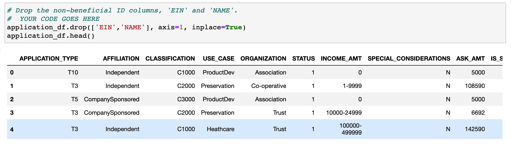
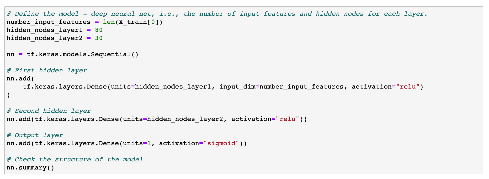
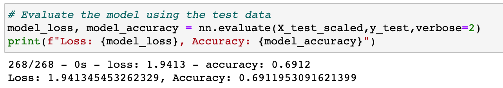

# Neural_Network_Charity_Analysis

## Table of Contents
- [1.0 Project Overview](#Project-Overview)
  * 1.1 Purpose
- [2.0 Results](#Results)
  * 2.1 Data Preprocessing
  * 2.2 Compiling, Training, and Evaluating the Model
- [3.0 Summary](#Summary)

## Project Overview
### 1.1 Purpose
Using Machine Learning and Neural Networks to identify if applicants will be successful for funding by Alphabet Soup.  There are over 34,000 applicants who have received funding in the past. The are three deliverables for this project:
  - Process the data for a Neural Network
  - Compile, Train, and Evaluate the Model
  - Optimize the Model

## Results

### 2.1 Data PreProcessing:

The data that is considered the target for this model is "IS_SUCCESSFUL". The variables that are considered to tbe features of the model are all the columns except for 'IS_SUCCESSFUL', 'EIN', and 'NAME'. The variables that are considered neither targets or features are 'EIN' and 'NAME'. 

 

### 2.2 Compiling, Training, and Evaluating the Model:

The first model has 2 hidden layers with 80 nuerons and 30 neurons respectively. For this model ReLU activation is used for the input and Sigmoid activation is used for the output. 

 

This model did not provide the target model performance of 75%.   

 

## Summary

The overall accuracy of this model did not meet the target of 75%. For this reason RandomForestClassifier would be better as you can train the model with the branches, increasing accuracy.  With neural networks the model was becoming overfitted, so therefore the accuracy was decreasing. 
