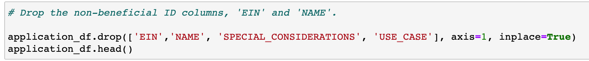
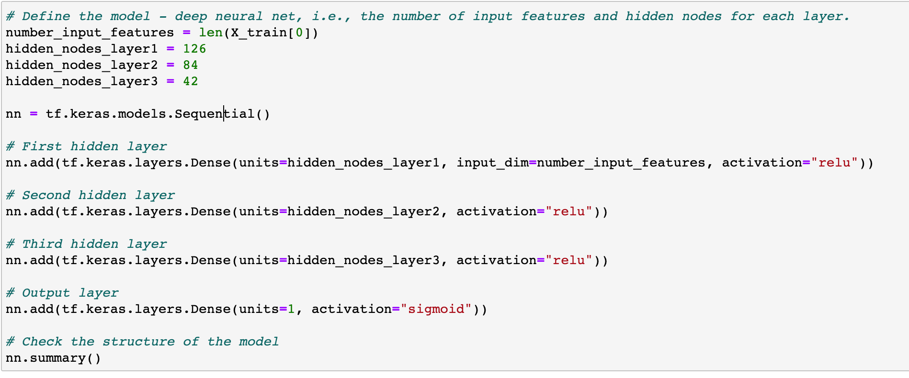
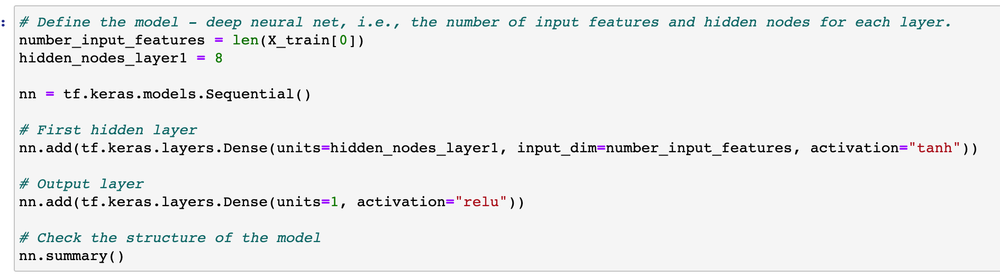

# Neural_Network_Charity_Analysis

## Table of Contents
- [1.0 Project Overview](#Project-Overview)
  * 1.1 Purpose
- [2.0 Results](#Results)
  * 2.1 Data Preprocessing
  * 2.2 Compiling, Training, and Evaluating the Model
- [3.0 Summary](#Summary)

## Project Overview
### 1.1 Purpose
Using Machine Learning and Neural Networks to identify if applicants will be successful for funding by Alphabet Soup.  There are over 34,000 applicants who have received funding in the past. The are three deliverables for this project:
  - Process the data for a Neural Network
  - Compile, Train, and Evaluate the Model
  - Optimize the Model

## Results

### 2.1 Data PreProcessing:

The data that is considered the target for this model is "IS_SUCCESSFUL". The variables that are considered to tbe features of the model are all the columns except for 'IS_SUCCESSFUL', 'EIN', and 'NAME'. The variables that are considered neither targets or features are 'EIN' and 'NAME'. 

 

1st Attempt: 
In the first attempt to improve the neural network more variables were removed to clean up the dataset.  In this model the following columns are considered neither targets or features: 'EIN', 'NAME', 'SPECIAL_CONSIDERATION', and 'USE_CASE'. 

 

### 2.2 Compiling, Training, and Evaluating the Model:

The original model has 2 hidden layers with 80 nuerons and 30 neurons respectively. For this model ReLU activation is used for the input and Sigmoid activation is used for the output. 

 

This model did not provide the target model performance of 75%.   

 

1st Attempt: 
In this model the accuracy was 67%, which is less than the target.  In this model the hidden layers had 8 and 5 neurons, and the activate methods were kept the same as ReLU and Sigmoid. 

 

2nd Attempt: 
In attempt to improve the network hidden networks are added and the neurons were adjusted. There are 3 hidden layers and the neurons are respectively 126, 84, and 42. In this attempt the accuracy decreased to 61% due to overfitting. 

 

3rd Attempt:
In this attempt the hidden networks were reduced to one and the number of neurons is 8. The activation method used is Tanh and the output method is ReLU. In this attempt the accuracy decreased further to 47%. 

 

## Summary

The overall accuracy of this model was 61%, which did not meet the target of 75%. With neural networks the model was becoming overfitted, so therefore the accuracy was decreasing.  Additional columns also could be removed to help improve the accuracy as well. For this reason RandomForestClassifier would be better as you can train the model with the branches, increasing accuracy.   
